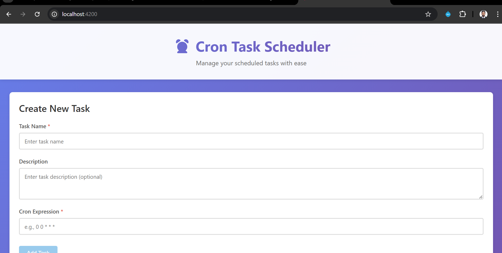
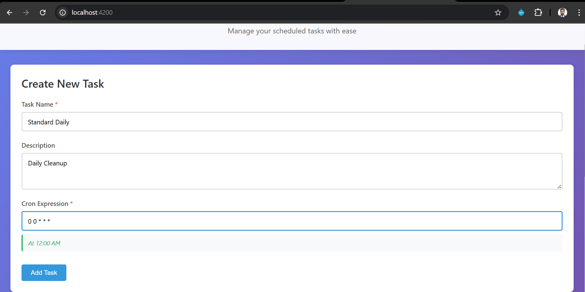
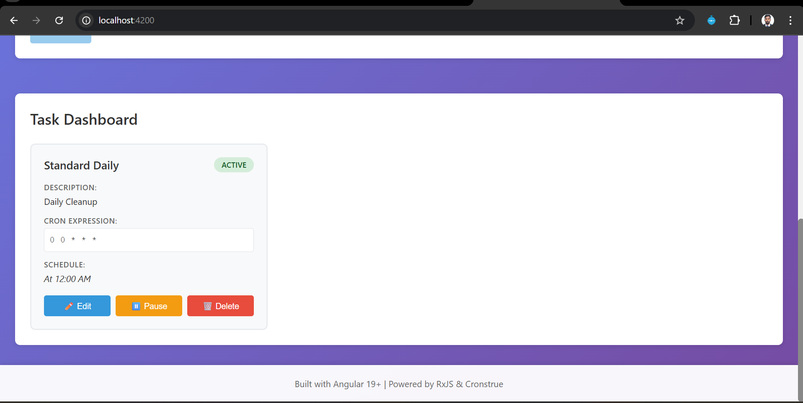
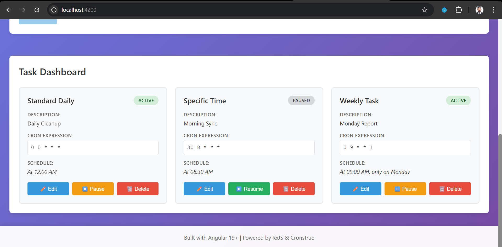
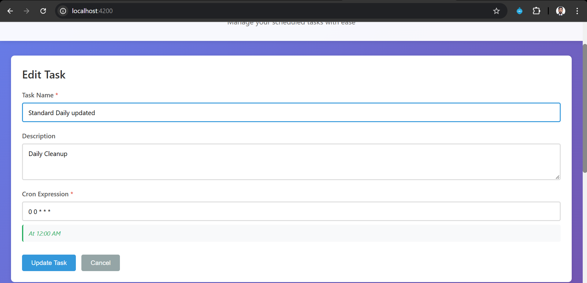
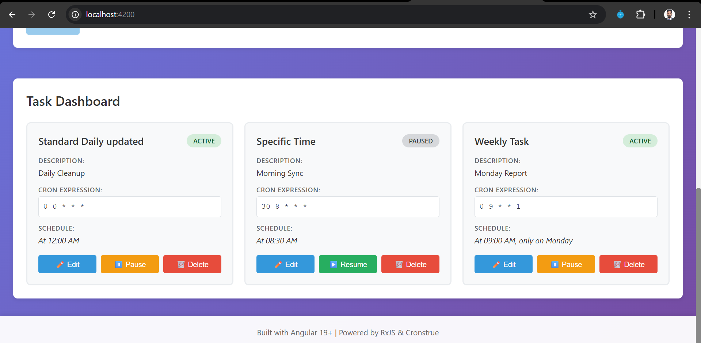
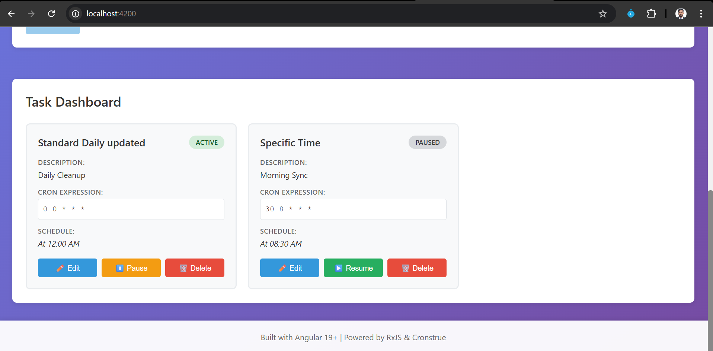
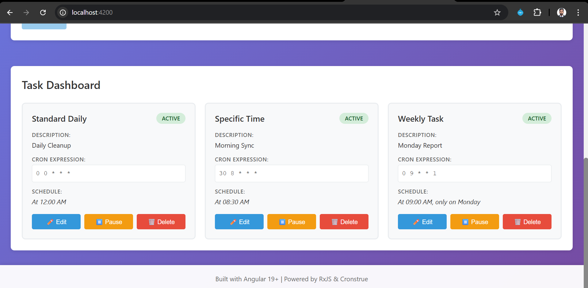

# ⏰ Cron Task Scheduler

A modern, responsive Single Page Application (SPA) built with Angular 19+ for managing scheduled tasks using cron expressions. Features real-time cron validation, human-readable schedule translation, and comprehensive property-based testing.

## 📸 Screenshots

### Application Overview


### Task Creation Form


### Real-Time Cron Validation


### Task Dashboard


### Task Management


### Edit Task


### Responsive Design


### Complete Interface


## ✨ Features

- **Task Management**: Create, edit, delete, and manage scheduled tasks
- **Real-Time Cron Validation**: Instant human-readable translation of cron expressions as you type
- **Reactive State Management**: Pure RxJS-based state management with BehaviorSubject
- **Reactive Forms**: Angular Reactive Forms with comprehensive validation
- **Task Status Control**: Pause and resume tasks with visual indicators
- **Responsive Design**: Mobile-first design that works on all screen sizes
- **Property-Based Testing**: Comprehensive test coverage using fast-check
- **Professional UI**: Clean, modern interface with smooth animations

## 🚀 Tech Stack

- **Framework**: Angular 19+
- **Forms**: Angular Reactive Forms (FormBuilder, FormGroup, FormControl)
- **State Management**: RxJS (BehaviorSubject, Observable)
- **Cron Translation**: [cronstrue](https://www.npmjs.com/package/cronstrue)
- **Testing**: Jasmine, Karma, [fast-check](https://www.npmjs.com/package/fast-check)
- **Styling**: Custom CSS with responsive design

## 📋 Prerequisites

Before you begin, ensure you have the following installed:

- **Node.js**: v18.x or higher
- **npm**: v9.x or higher
- **Angular CLI**: v19.x or higher

To install Angular CLI globally:

```bash
npm install -g @angular/cli
```

## 🛠️ Installation

1. **Clone the repository**:

```bash
git clone https://github.com/Ahmadraza301/cron-task-scheduler.git
cd cron-task-scheduler
```

2. **Install dependencies**:

```bash
npm install
```

This will install all required packages including:
- Angular core packages
- cronstrue (for cron expression translation)
- fast-check (for property-based testing)

## 🏃 Running the Application

### Development Server

Start the development server:

```bash
ng serve
```

Navigate to `http://localhost:4200/` in your browser. The application will automatically reload if you change any source files.

### Production Build

Build the project for production:

```bash
ng build
```

The build artifacts will be stored in the `dist/` directory.

## 🧪 Running Tests

### Run All Tests

Execute the test suite:

```bash
ng test
```

### Run Tests Without Watch Mode

For CI/CD or one-time test execution:

```bash
ng test --watch=false
```

### Test Coverage

Generate test coverage report:

```bash
ng test --code-coverage
```

## 📁 Project Structure

```
cron-task-scheduler/
├── src/
│   ├── app/
│   │   ├── components/
│   │   │   ├── task-form/          # Task creation/editing form
│   │   │   │   ├── task-form.ts
│   │   │   │   ├── task-form.html
│   │   │   │   ├── task-form.css
│   │   │   │   └── task-form.spec.ts
│   │   │   └── task-dashboard/     # Task list and management
│   │   │       ├── task-dashboard.ts
│   │   │       ├── task-dashboard.html
│   │   │       ├── task-dashboard.css
│   │   │       └── task-dashboard.spec.ts
│   │   ├── models/
│   │   │   └── task.model.ts       # Task interface and TaskStatus enum
│   │   ├── services/
│   │   │   ├── task.ts             # TaskService with RxJS state management
│   │   │   └── task.spec.ts
│   │   ├── app.ts                  # Root component
│   │   ├── app.html
│   │   ├── app.css
│   │   └── app-module.ts           # App module configuration
│   ├── styles.css                  # Global styles
│   └── index.html
├── .kiro/
│   └── specs/
│       └── cron-task-scheduler/    # Specification documents
│           ├── requirements.md
│           ├── design.md
│           └── tasks.md
├── package.json
├── angular.json
├── tsconfig.json
└── README.md
```

## 🎯 Usage Guide

### Creating a Task

1. Enter a task name (required)
2. Add an optional description
3. Enter a cron expression (required)
   - Example: `0 0 * * *` (Daily at midnight)
   - Example: `*/5 * * * *` (Every 5 minutes)
   - Example: `0 12 * * 1-5` (Weekdays at noon)
4. See the human-readable translation appear in real-time
5. Click "Add Task" to create the task

### Editing a Task

1. Click the "Edit" button on any task card
2. The form will populate with the task's current data
3. Make your changes
4. Click "Update Task" to save

### Managing Tasks

- **Pause/Resume**: Click the pause/resume button to toggle task status
- **Delete**: Click the delete button to remove a task
- **View Schedule**: See the human-readable cron schedule on each task card

### Cron Expression Examples

| Expression | Description |
|------------|-------------|
| `0 0 * * *` | Daily at midnight |
| `0 12 * * *` | Daily at noon |
| `*/5 * * * *` | Every 5 minutes |
| `0 0 1 * *` | First day of every month |
| `0 0 * * 0` | Every Sunday at midnight |
| `30 2 * * 1-5` | Weekdays at 2:30 AM |
| `0 */4 * * *` | Every 4 hours |

## 🧪 Testing Strategy

The application uses a dual testing approach:

### Unit Tests
- Test specific examples and edge cases
- Validate form validation logic
- Test component initialization
- Verify error handling

### Property-Based Tests
- Validate universal properties across many generated inputs
- Test with 100+ iterations per property
- Ensure correctness across all possible input combinations
- Catch edge cases that manual testing might miss

### Test Coverage

- **TaskService**: 8 property-based tests
- **TaskFormComponent**: 8 tests (including property-based tests)
- **TaskDashboardComponent**: 4 property-based tests
- **Total**: 20+ tests with comprehensive coverage

## 🎨 Design Principles

- **Reactive Programming**: Leverages RxJS for reactive state management
- **Type Safety**: Full TypeScript with strict mode enabled
- **Component-Based**: Modular architecture with clear separation of concerns
- **Responsive Design**: Mobile-first approach with breakpoints for all devices
- **Accessibility**: Semantic HTML and ARIA labels
- **Performance**: Optimized change detection and immutable state updates

## 🔧 Configuration

### TypeScript Configuration

The project uses strict TypeScript configuration:
- `strict`: true
- `noImplicitReturns`: true
- `noFallthroughCasesInSwitch`: true

### Angular Configuration

- **Standalone Components**: TaskFormComponent and TaskDashboardComponent use standalone architecture
- **Reactive Forms**: Strict form typing with FormBuilder
- **RxJS**: BehaviorSubject for state management

## 📝 Specification Documents

The project includes comprehensive specification documents in `.kiro/specs/cron-task-scheduler/`:

- **requirements.md**: EARS-formatted requirements with acceptance criteria
- **design.md**: Technical design with architecture, components, and correctness properties
- **tasks.md**: Implementation task list with sub-tasks

## 🤝 Contributing

Contributions are welcome! Please follow these steps:

1. Fork the repository
2. Create a feature branch (`git checkout -b feature/amazing-feature`)
3. Commit your changes (`git commit -m 'Add amazing feature'`)
4. Push to the branch (`git push origin feature/amazing-feature`)
5. Open a Pull Request

## 📄 License

This project is open source and available under the [MIT License](LICENSE).

## 👤 Author

**Ahmad Raza**
- GitHub: [@Ahmadraza301](https://github.com/Ahmadraza301)

## 🙏 Acknowledgments

- [Angular](https://angular.dev/) - The web framework
- [cronstrue](https://www.npmjs.com/package/cronstrue) - Cron expression translation
- [fast-check](https://www.npmjs.com/package/fast-check) - Property-based testing
- [RxJS](https://rxjs.dev/) - Reactive programming library

## 📞 Support

If you have any questions or run into issues, please open an issue on GitHub.

---

Built with ❤️ using Angular 19+ | Powered by RxJS & Cronstrue
